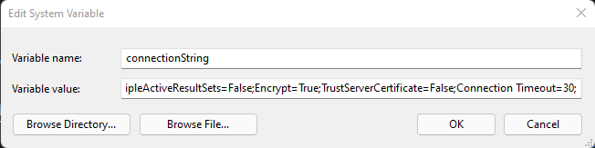
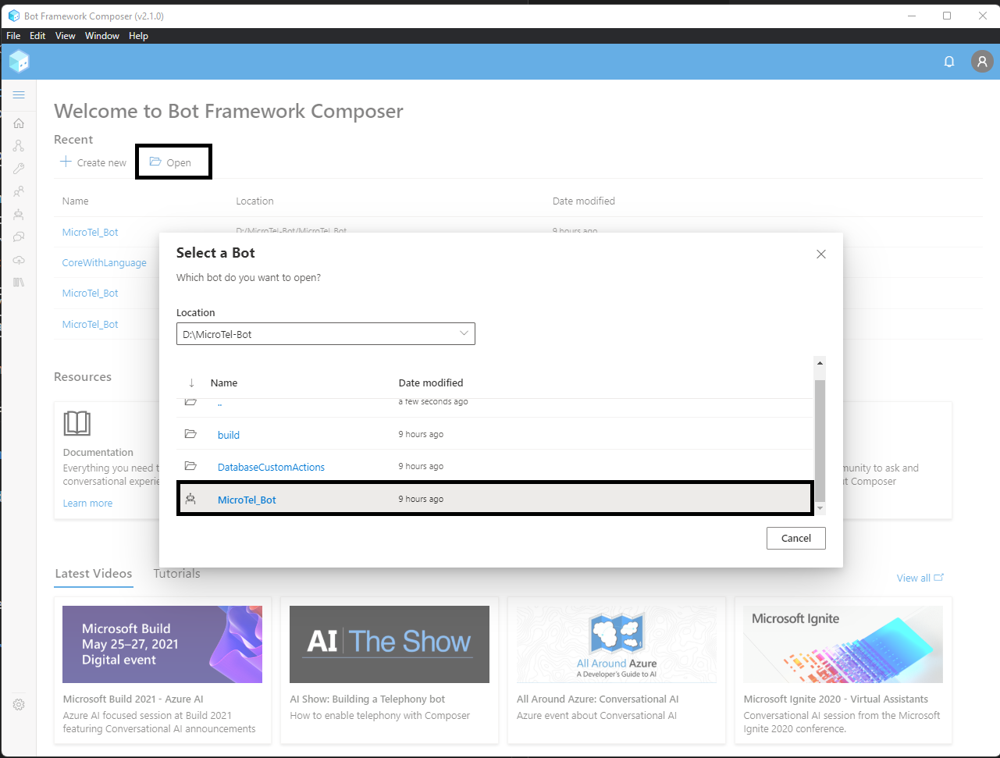
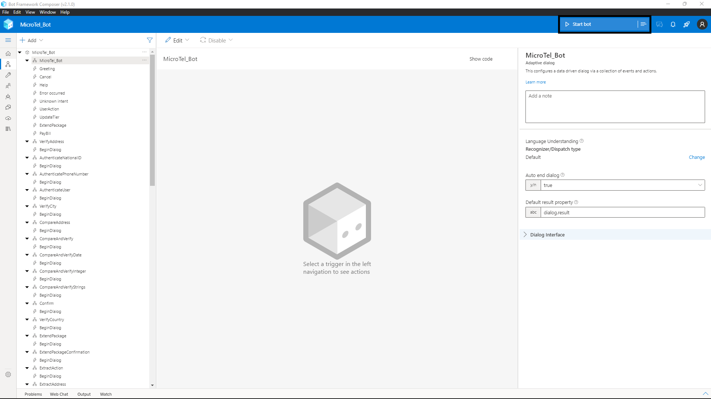
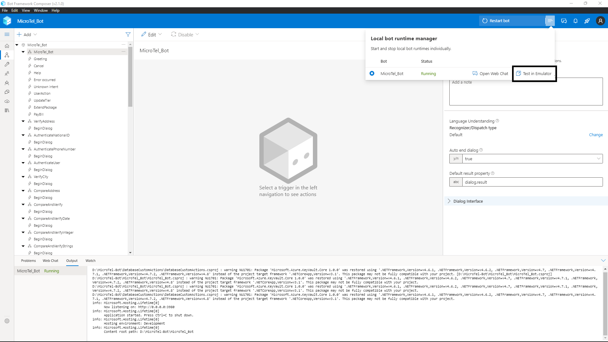

# Microtel-Bot
**version 1.0.0**

### Overview

Microtel-Bot is an enterprise-grade Customer Support sample solution directed towards Telecommunications industry. The bot is built with LUIS, Bot Framework (Composer), and Azure Sql Server. 

Customers may use Microtel-Bot to sign up for new phone lines, inquire about their current quota, or bill, manage their phone line options, learn about company policies and promotions, and cancel their subscription at any time.  


### Built With

- [.NET Framework](https://docs.microsoft.com/en-us/dotnet/)
- [Bot Framework Composer](https://docs.microsoft.com/en-us/composer/introduction?tabs=v2x) 
- [Luis.ai](https://docs.microsoft.com/en-us/azure/cognitive-services/luis/)  
- [QnA Maker](https://azure.microsoft.com/en-us/services/cognitive-services/qna-maker/#overview)
- [Azure Sql DB](https://azure.microsoft.com/en-us/products/azure-sql/database/)


### Getting Started
 
#### Prerequisites
- Install [Node.js](https://nodejs.org/en/) LTS 14.x with npm.
- Install [.NET Core](https://dotnet.microsoft.com/download/dotnet/3.1) SDK 3.1 or later.
- Install [Bot Framework Composer](https://docs.microsoft.com/en-us/composer/install-composer?tabs=windows) 
- Install [Bot Framework Emulator](https://github.com/microsoft/BotFramework-Emulator/releases) 
- Install [Visual Studio](https://visualstudio.microsoft.com/vs/community/)
- Create an Azure Sql Database. 

#### Installation 
1. Clone Microtel-Bot repository to your local machine 
```
git clone https://github.com/ahmedmeshref/MicroTel-Bot.git
```
2. Add the connection string of your Azure Sql Database to your operating system's environment variables with the key name 'connectionString'.
    - Example: [Setup environment variable in windows](https://docs.oracle.com/en/database/oracle/machine-learning/oml4r/1.5.1/oread/creating-and-modifying-environment-variables-on-windows.html). 
        

3. Using Bot Framework Composer, open Microtel-Bot solution. 
    

4. Run solution from composer.
    

5. Test application in Emulator when run process in done.
    
    - Clicking on 'Test in Emulator' button will open the bot in emulator for testing.  


### Usage

> LINK to User Manual

### Public to Azure  

> While we use Microsoft Azure to host Microtel-Bot solution, you can use any cloud provider of choice.    

#### Prerequisites
- A subscription to [Microsoft Azure](https://azure.microsoft.com/en-us/free/).
- Bot solution hosted on Github.


