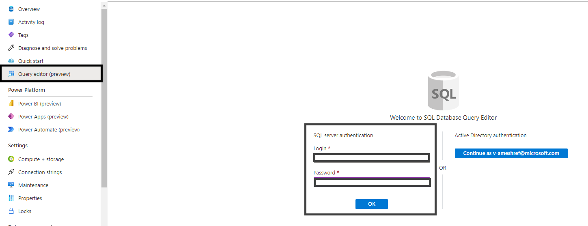
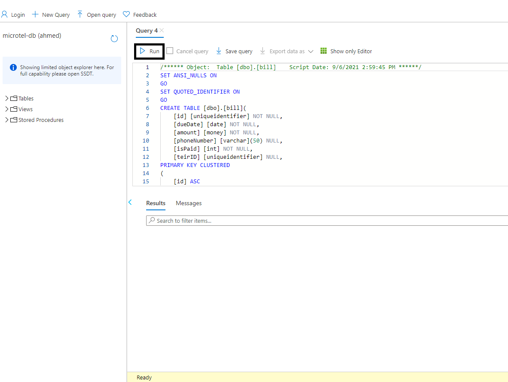
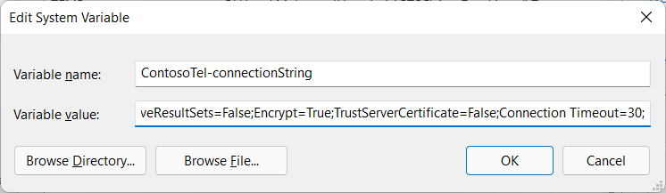
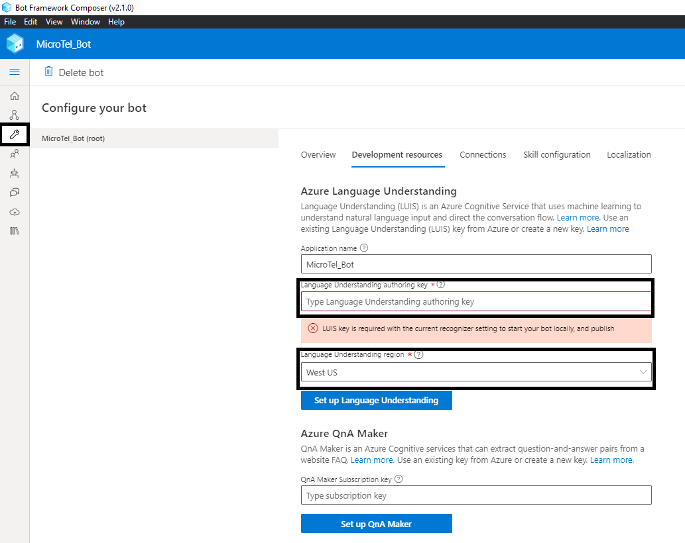

# Microtel-Bot
**version 1.0.0**

### Overview

Microtel-Bot is an enterprise-grade Customer Support sample solution directed towards the Telecommunications industry. The bot is built with LUIS, Bot Framework (Composer), and Azure SQL Server. 

Customers may use Microtel-Bot to sign up for new phone lines, inquire about their current quota, or bill, manage their phone line options, learn about company policies and promotions, and cancel their subscription at any time.  


### Built With

- [.NET Framework](https://docs.microsoft.com/en-us/dotnet/)
- [Bot Framework Composer](https://docs.microsoft.com/en-us/composer/introduction?tabs=v2x) 
- [Luis.ai](https://docs.microsoft.com/en-us/azure/cognitive-services/luis/)  
- [QnA Maker](https://azure.microsoft.com/en-us/services/cognitive-services/qna-maker/#overview)
- [Azure SQL DB](https://azure.microsoft.com/en-us/products/azure-sql/database/)


### Getting Started
 
#### Prerequisites
- Install [Node.js](https://nodejs.org/en/) LTS 14.x with npm.
- Install [.NET Core](https://dotnet.microsoft.com/download/dotnet/3.1) SDK 3.1 or later.
- Install [Bot Framework Composer](https://docs.microsoft.com/en-us/composer/install-composer?tabs=windows) 
- Install [Bot Framework Emulator](https://github.com/microsoft/BotFramework-Emulator/releases) 
- Install [Visual Studio](https://visualstudio.microsoft.com/vs/community/)
- Create an [Azure SQL Database](https://docs.microsoft.com/en-us/azure/azure-sql/database/single-database-create-quickstart?tabs=azure-portal).
- Fetch and save your [Azure SQL Database connection string](https://docs.microsoft.com/en-us/azure/azure-sql/database/connect-query-content-reference-guide#get-adonet-connection-information-optional---sql-database-only). 
- Create [Luis.ai Resource](https://docs.microsoft.com/en-us/azure/cognitive-services/luis/sign-in-luis-portal). 
- Fetch and save your [Luis.ai Subscription Key](https://docs.microsoft.com/en-us/azure/cognitive-services/luis/luis-how-to-azure-subscription?tabs=portal).

#### Installation 
1. Clone Microtel-Bot repository to your local machine 
```
git clone https://github.com/ahmedmeshref/MicroTel-Bot.git
```

2. Run microtel-db SQL script in your Azure SQL Database.
   1. From your Azure SQL DB console, navigate to <b>Query Editor</b> and log in with your username and password. 
   
   1. From the top menu, select <b>open query</b> and then <b>select SQL files</b>.
   2. Navigate to your cloned project and select <b>microte_db.sql</b>. Then, click <b>OK</b> button. 
    
   3. Run the loaded script.
   

   
3. Add the connection string of your Azure SQL Database to your operating system's environment variables with the key name 'connectionString'.
    - Example: [Setup environment variable in windows](https://docs.oracle.com/en/database/oracle/machine-learning/oml4r/1.5.1/oread/creating-and-modifying-environment-variables-on-windows.html). 
        

4. Launch Bot Framework Composer and use it to open Microtel-Bot solution. 
    

5. Add your [Luis Subscription Key to Bot Framework Composer](https://docs.microsoft.com/en-us/composer/how-to-add-luis?tabs=v2x#update-luis-keys). 
    

6. Run solution from Bot Framework composer.
    

7. Test application in Bot Emulator when the run process in done.
    
    - Clicking on 'Test in Emulator' button will open the bot in Emulator for testing.  


### Usage

> LINK to User Manual

### Public to Azure  

> While we use Microsoft Azure to host Microtel-Bot solution, you can use any cloud provider of choice.    

#### Deployment

Kindly follow [this guide](https://docs.microsoft.com/en-us/composer/how-to-publish-bot?tabs=v2x) to deploy your bot to Azure from Bot Framework Composer.

#### Build CI/CD Pipeline

CI/CD helps you to easily and quickly deploy new versions of your bot. Follow [this guide](https://docs.microsoft.com/en-us/composer/how-to-cicd) to build a CI/CD pipeline for Microtel-Bot.

> Note: The YAML files required for building an azure CI/CD pipeline can be found in Microtel-Bot's main directory [here](https://github.com/ahmedmeshref/MicroTel-Bot/blob/main/build/yaml).   