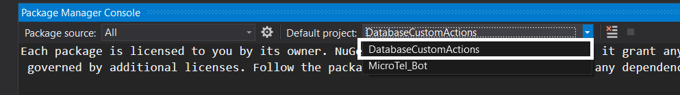

# Contoso-Bot
**version 1.0.0**

### Overview

Contoso-Bot is an enterprise-grade Customer Support sample solution directed towards the Telecommunications industry. The bot is built with LUIS, Bot Framework (Composer), and Azure SQL Server. 

Customers may use Contoso-Bot to sign up for new phone lines, inquire about their current quota, or bill, manage their phone line options, learn about company policies and promotions, and cancel their subscription at any time.  


### Built With

- [.NET Framework](https://docs.microsoft.com/en-us/dotnet/)
- [Bot Framework Composer](https://docs.microsoft.com/en-us/composer/introduction?tabs=v2x) 
- [Luis.ai](https://docs.microsoft.com/en-us/azure/cognitive-services/luis/)  
- [QnA Maker](https://azure.microsoft.com/en-us/services/cognitive-services/qna-maker/#overview)
- [Azure SQL DB](https://azure.microsoft.com/en-us/products/azure-sql/database/)


### Getting Started
 
#### Prerequisites
1. Install [Node.js](https://nodejs.org/en/) LTS 14.x with npm.
2. Install [.NET Core](https://dotnet.microsoft.com/download/dotnet/3.1) SDK 3.1 or later.
3. Install [Bot Framework Composer](https://docs.microsoft.com/en-us/composer/install-composer?tabs=windows) 
4. Install [Bot Framework Emulator](https://github.com/microsoft/BotFramework-Emulator/releases) 
5. Install [Visual Studio](https://visualstudio.microsoft.com/vs/community/)
6. Create an [Azure SQL Database](https://docs.microsoft.com/en-us/azure/azure-sql/database/single-database-create-quickstart?tabs=azure-portal).
7. Create [Luis.ai Resource](https://docs.microsoft.com/en-us/azure/cognitive-services/luis/sign-in-luis-portal). 

#### Installation 
1. Clone Contoso-Bot repository to your local machine 
```
git clone https://github.com/ahmedmeshref/Contoso-Bot.git
```
> Note: Please make sure to clone your repostory in a folder with a short path.  

2. Add the connection string of your Azure SQL Database to your operating system's environment variables.
   1. From your browser, navigate to you Azure SQL Database and fetch your [Azure SQL Database connection string](https://docs.microsoft.com/en-us/azure/azure-sql/database/connect-query-content-reference-guide#get-adonet-connection-information-optional---sql-database-only). 
   2. Update your fetched connection string with your username and password. 
   3. [Setup an environment variable](https://docs.oracle.com/en/database/oracle/machine-learning/oml4r/1.5.1/oread/creating-and-modifying-environment-variables-on-windows.html) with the variable name 'ContosoTel-connectionString' and variable value of your fetched connection string.   
     

3. From your Azure SQL firewall rules, [Add your device IP address to the list of authorized IP addresses](https://docs.microsoft.com/en-us/azure/azure-sql/database/firewall-configure). 

4. Update database schema
   1. Navigate to your cloned project and open the solution `MicroTel_Bot.sln`  **Please make sure to do step 2 before opening the solution.**
   2. open the console in Visual Studio, go to the main menu and select [*Tools > NuGet Package Manager > Package Manager Console command.*](https://nuget-tutorial.net/en/tutorial/100009/package-manager-console#:~:text=To%20open%20the%20console%20in,Manager%20%3E%20Package%20Manager%20Console%20command.)
   3. Set `DatabaseCustomActions` as the default project.
  
   4. run this command `EntityFrameworkCore\Add-Migration initialCreate`.
   5. then run this command `EntityFrameworkCore\Update-Database` to update the schema of your database.
   

5. Launch Bot Framework Composer and use it to open Contoso-Bot solution. 
    

6. Fetch your Luis application Subscription Key and Region.
   1. From your browser, navigate to [luis.ai](https://luis.ai/).
   2. Select any app from the My apps list. If you dont have any, please create an empty Luis application. 
   3. From your app, navigate to Manage > Azure Resources.  
   4. From Azure Resources page, select Authoring Resources. 
   5. Copy Location (Region) and Primary Key (Subscription Key).
   


7. Add your previously fetched [Luis Subscription Key to Bot Framework Composer and Region](https://docs.microsoft.com/en-us/composer/how-to-add-luis?tabs=v2x#update-luis-keys). 
    

8.  Run solution from Bot Framework composer.
     
    > Note: If you get the following error ```Cannot open server ‘myserverluis’ requested by the login. Client with IP address ‘167.220.197.236’ is not allowed to access the server. To enable access, use the Windows Azure Management Portal or run sp_set_firewall_rule on the master database to create a firewall rule for this IP address or address range. It may take up to five minutes for this change to take effect.```, move the project directory to a shorter path.  

9. Test application in Bot Emulator when the run process in done.
    
    - Clicking on 'Test in Emulator' button will open the bot in Emulator for testing.  


### Usage

> LINK to User Manual

### Public to Azure  

> While we use Microsoft Azure to host Contoso-Bot solution, you can use any cloud provider of choice.    

#### Deployment

Kindly follow [this guide](https://docs.microsoft.com/en-us/composer/how-to-publish-bot?tabs=v2x) to deploy your bot to Azure from Bot Framework Composer.

#### Build CI/CD Pipeline

CI/CD helps you to easily and quickly deploy new versions of your bot. Follow [this guide](https://docs.microsoft.com/en-us/composer/how-to-cicd) to build a CI/CD pipeline for Contoso-Bot.

> Note: The YAML files required for building an azure CI/CD pipeline can be found in Contoso-Bot's main directory [here](https://github.com/ahmedmeshref/Contoso-Bot/blob/main/build/yaml).   
